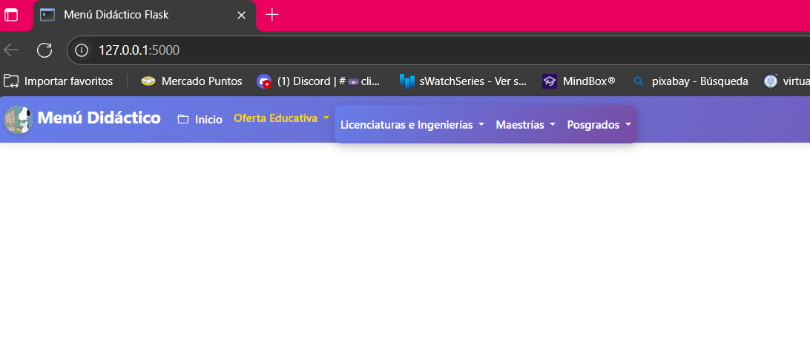
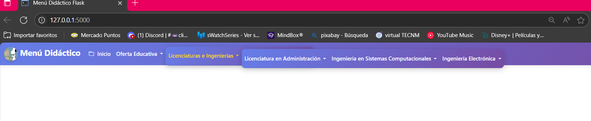

# Menú Recursivo Dinámico con Flask y Bootstrap 

**Nombre de la alumna:** Erika Viaey Jimenez Pelayo

**Materia:** Estructura de Datos 

**Maestro:** Kevin David Molina Gomez

- ## main.py
Este archivo es el núcleo de la aplicación Flask.

Aquí se define la estructura del menú como un diccionario anidado y se configura la ruta principal (`/`) para renderizar la plantilla HTML del menú dinámico. 

Al ejecutar este archivo, se inicia el servidor web y se muestra la interfaz del menú didáctico de manera clara y llamativa 

- ## menu.html

Esta plantilla HTML utiliza Bootstrap para mostrar una barra de navegación interactiva y colorida.
El menú se genera dinámicamente a partir del diccionario definido en `main.py`, permitiendo submenús anidados.
 
  Además, incluye el logo de Snoopy (programador) en la esquina superior izquierda y estilos personalizados para una mejor apariencia visual.

